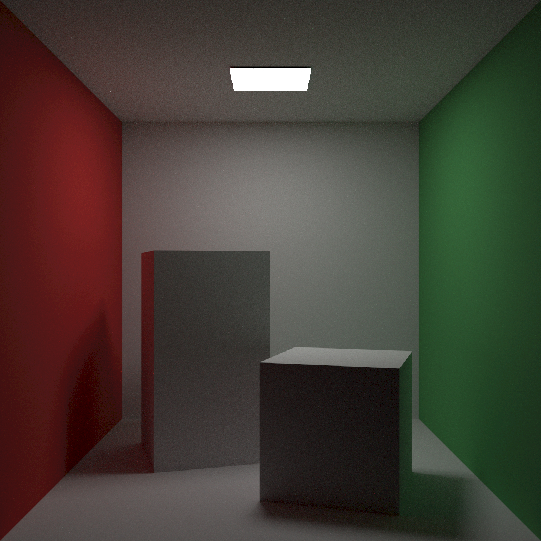
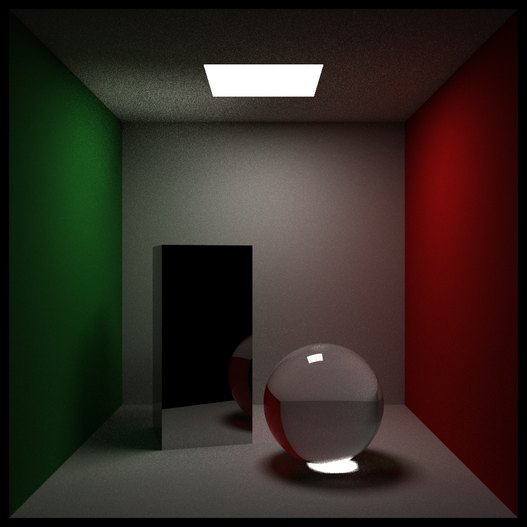
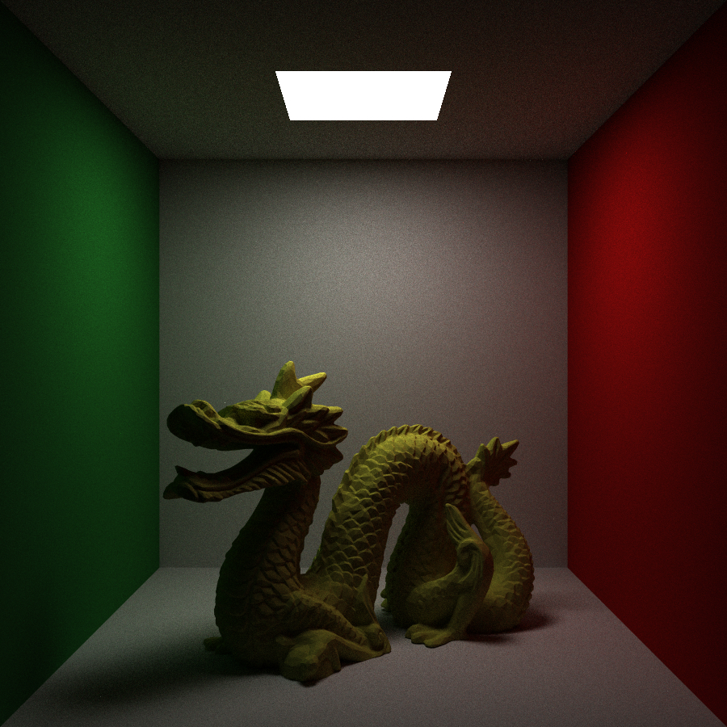
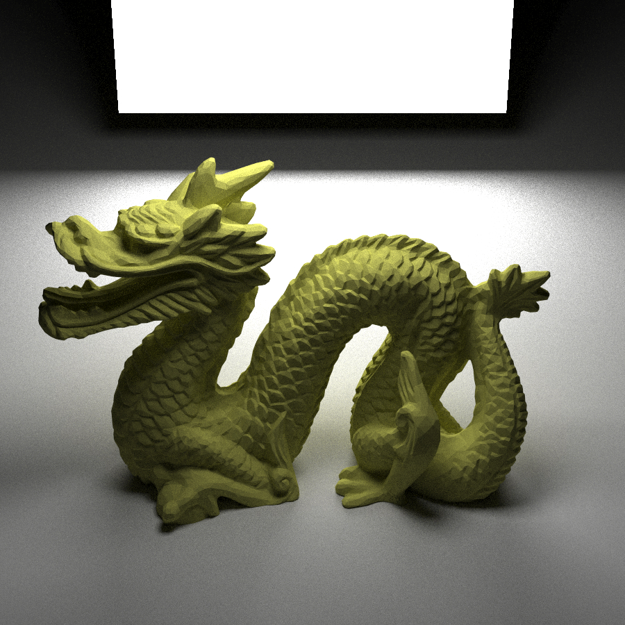
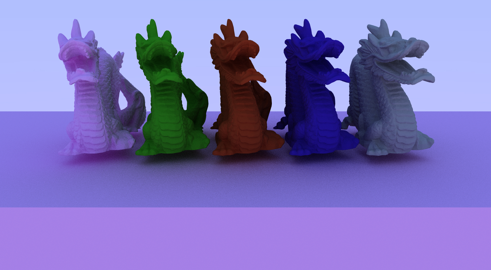
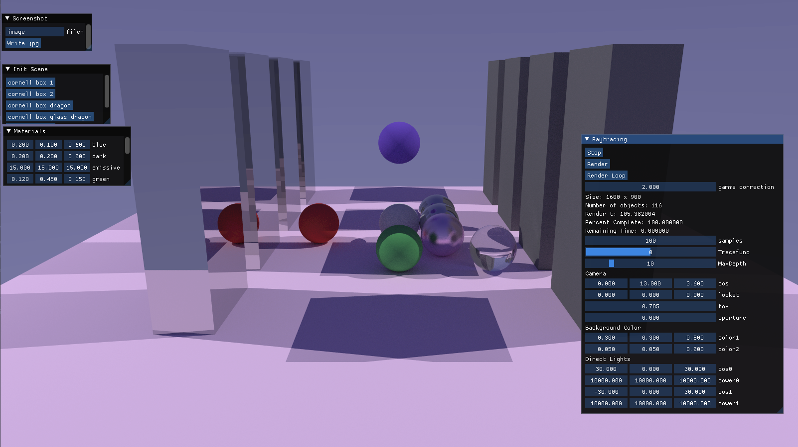

# CPU Path Tracer in C++

## External libraries
- SDL2, GLEW for opening a window and displaying the image (https://www.libsdl.org/,  http://glew.sourceforge.net/)
- GLM for vector math (https://github.com/g-truc/glm)
- stb for saving images (https://github.com/nothings/stb)
- Dear ImGui for the interface (https://github.com/ocornut/imgui)